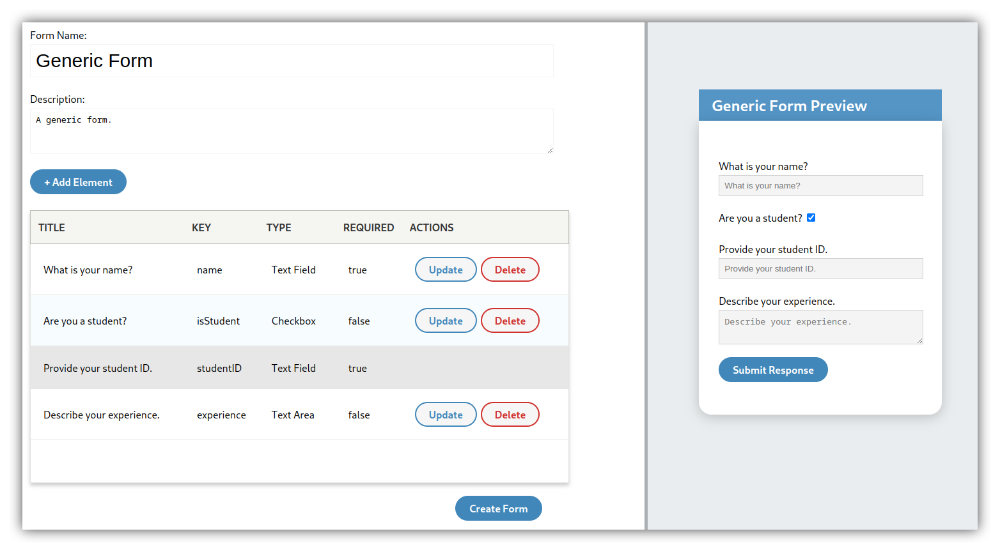
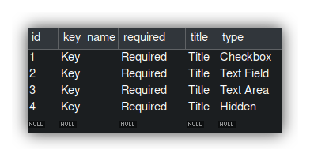

# Form Creation App

Form Creation App is a full-stack application that creates customized web forms. The goal of this project was to prototype a web form creating application for a client.

# Preview



# Configuration
Before running the application, you need to have a MySQL server running. It also needs to have a database called `user_form_management_system` already created.

In your database, create a table called `default_elements` and include the following:


Edit the configuration file located in `./backend/build/resources/main/application.properties` to match your MySQL server's username and password.

# Build
In the root project directory, run:
```
./gradlew build
```
The output directory where the WAR file is located in `./backend/build/libs/`.

# Usage
You can run the WAR file by using Java:
```
java -jar ./backend/build/libs/app.war
```

Then open up a browser and view the application on `localhost:8080`.

# License
This project is licensed under the MIT License. See [LICENSE](./LICENSE).
